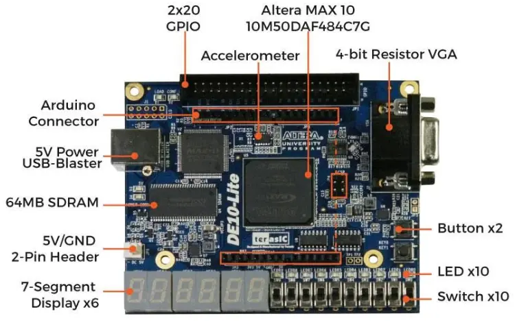
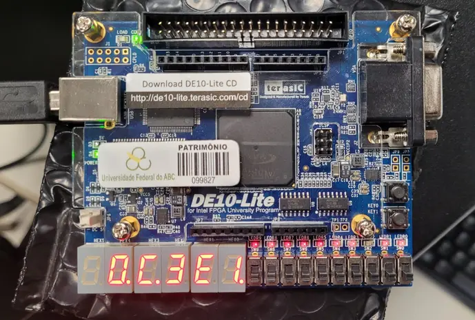

# Floating-Point Adder on FPGA Board

## 🌐​ Overview:
This project is based on coding an Intel FPGA board with the aim of correctly and safely implementing a simplified floating-point adder.

## 🤔​ What Is An FPGA Board:
An FPGA (Field-Programmable Gate Array) is essentially a "blank" integrated circuit that can be completely reconfigured by the developer after it has been manufactured.

Unlike a common processor in your computer or cell phone, which comes with pre-defined and immutable circuit factories, an FPGA allows you to create your own digital hardware from scratch.



## 🔥​ Motivation:
The presented project is based on the development of four VHDL codes that will be used to implement a floating-point adder on the Intel/Altera/TerAsic DE10-Lite board, using the board's switches (ranging from 0 to 9) as inputs and the LEDs present in the six seven-segment displays as outputs. Regarding the importance of this project, it's worth noting that these adders are fundamental in the arithmetic processing units of modern processors, such as CPUs and GPUs. They play a vital role in the overall system performance, especially in tasks involving intensive calculations. Furthermore, designing a floating-point adder involves dealing with challenges such as rounding, normalization, and exception handling (such as overflow and underflow).

## 🔢​ Number Structure:
The DE10-Lite license plate will receive a number that has the following elements:

* Sign (+ or -)
* Zero (0)
* Period (.)
* Mantissa (Number)
* Letter E
* Exponent (Number)

Example: An example of this format would be the number shown below, which expresses a positive result where the mantissa and the exponent are hexadecimal numbers.
```
+0.53E2
```

## 🔨​ How It Works:
The floating-point adder implementation is basically divided into three distinct stages: data reception, data processing, and finally, data output on the six seven-segment displays. Data reception is handled by the file “fp_adder_test.vhd”, where the signs, exponents, and mantissas of the two numbers are received from a loop. The values ​​are entered into the switches (SW), the KEY0 button activates the clock, and the KEY1 button resets the data input. After receiving this data, arithmetic operations are performed in the “fp_adder.vhd” file, where the signs, exponents, and mantissas of the two numbers are processed to generate a response that conforms to the normalization rules. After this initial processing, the data is sent to the “hex_to_sseg.vhd” file, where further processing determines which LEDs will light up on each seven-segment display. Finally, the file “disp_mux.vhd” correctly turns on the LEDs. Therefore, it can be inferred that:

* Input: “fp_adder_test.vhd”
* Processing: “fp_adder.vhd”
* Output: “disp_mux.vhd” and “hex_to_sseg.vhd”

## 🔧​ Tools Used:
The development of this project focused on two tools: GHDL and Quartus Prime. Both tools are geared towards the analysis, compilation, and simulation of digital circuit designs. The difference between these tools lies in the complexity involved in their use. GHDL offers a very simple way to simulate "testbenches," and being free software allows its use by a larger number of people. On the other hand, Quartus Prime is paid software from Intel, with a free (Lite) version that has limited features. Furthermore, Quartus is a more complex and complete tool than GHDL, as it involves more steps for simulating a "testbench" and allows for numerous other tasks. Therefore, both tools were used for different tasks and tests in this project. That is, GHDL+GTKWave was used to visualize the results of arithmetic operations, and Quartus Prime was used for the logical synthesis of the circuit.

## ​🎯​ Fundamental Operations:
1. Ordering: The number with the greater magnitude should be used as the pivot of the operation.
2. Alignment: Observe the exponent of each number and manipulate the decimal point to align both numbers based on the decimal point.
3. Addition/Subtraction: The addition or subtraction operation is performed based on the signs of the two numbers.
4. Normalization: After obtaining the final result, normalization is performed to correct the representation of the final number. There are three types of normalization that can occur:
* If there are zeros to the left of the number.
* If the result is too small.
* If a "carry-out" occurs.

## ​🧩​ Example:
* Sign1 = 0 (HEX) = 0 (BIN) = 0 (DEC)
* Frac1 = 82 (HEX) = 10000010 (BIN) = 130 (DEC)
* Exp1 = 1 (HEX) = 0001 (BIN) = 1 (DEC)

* Sign2 = 0 (HEX) = 0 (BIN) = 0 (DEC)
* Frac2 = 82 (HEX) = 10000010 (BIN) = 130 (DEC)
* Exp2 = 0 (HEX) = 0 (BIN) = 0 (DEC)

From another perspective, we have: +0.82E1 +0.82E0 = +0.82E1 + 0.08E1 or even
+10000010 +01000001 = 130 (DEC) + 65 (DEC) = 195 (DEC) = C3 (HEX).

Therefore, the final result is: +0.C3E1.



## ​🧠​ Usage Tutorial: DE10-Lite + Quartus Prime Board:
1. Open Quartus Prime version 20.1.
2. In the upper left corner of the screen, click on “File” and then click on “New Project Wizard”.
3. A window will appear with some information; click “Next”. In the next tab, choose a location of your preference to save the project and name the project “fp_adder_test”. Finally, click “Next”.
4. In the next tab, click on “Empty project” and click “Next”.
5. In the “Add Files” tab, click “Next”.
6. In the “Family, Device & Board Settings” tab, perform the following steps:
In the “Family” field, select “MAX 10 (DA/DF/DC/SA/SC)”.
In the “Name filter” field, write “10M50DAF484C7G”.
In the “Available devices” field, select the option that appeared.
Click “Next”.
7. In the “EDA Tool Settings” tab, perform the following steps:
In the “Simulation” row and “Tool Name” column, choose the option “ModelSim-Altera”. In the “Simulation” row and “Format” column, choose the option “VHDL”.
Click “Next”.
8. Finally, check the information and click “Finish” to create the project.
9. With the project open, click “File” and then click “New”. Once the window opens, choose the option “VHDL file”.
10. In the upper corner of the screen, click the “Edit” option and then click “Insert File” to import the VHDL files that are already ready. At this first moment, choose the file “fp_adder_test.vhd”. In the upper left corner, click “File” and then click “Save” to save the file in the folder that was created.
11. Repeat steps 9-10 for the files “fp_adder.vhd”, “hex_to_sseg.vhd”, and “disp_mux.vhd”. It is important to note that when “Save”, you need to correct the file name, otherwise an error will occur during compilation.
12. With all files open and saved in the folder, connect the DE10-Lite board to the computer via USB cable.
13. Map the board components using the QSF file located in the folder of the third Digital Systems lab. To perform the mapping, follow these steps:
In the upper left corner of the screen, click on “Assignments” and then on “Import Assignments”.
In the new window, select the file in question and click “OK”.
14. In the upper left corner of the screen, click on “Processing” and then click on “Start Compilation”. When the compilation is finished, it should show zero errors and 468 warnings.
15. In the left corner of the screen, in the “Task” window, double-click the “Program Device (Open Programmer)” option.
16. In the new window, click “Hardware Setup” and then in the “Currently selected hardware” field, select the USB option and click “Close”. In the upper right corner of the screen, make sure the “Mode” field is set to “JTAG”.
17. Finally, in the left corner of the screen, click “Start”.

After performing these steps, the board will be working and you will be able to perform arithmetic operations of addition and subtraction.

## ​🧠​ User Tutorial: Arithmetic Tests on the DE10-Lite Board:
The reception of values ​​on the board is based on six rising edges of the clock. Furthermore, the board will receive the values ​​in the following order:
Sign1 > Mantissa1 > Exponent1 > Signal2 > Mantissa2 > Exponent2

1. Initially, the board will be zeroed in the following format: 0.00E0.
2. Use switch “SW0” to receive the sign of the first number and press the button “KEY0” to memorize it.
3. Use switches “SW0” through “SW7” to receive the mantissa of the first number and press “KEY0” to memorize it.
4. Use switches “SW0” through “SW3” to receive the exponent of the first number and press “KEY0” to memorize it.
5. Repeat steps 2-4 for the second number.
6. If a typing error occurs at any stage of the process, press the “KEY1” button to reset the operation.

After these steps, the final result will appear on the six seven-segment displays.

